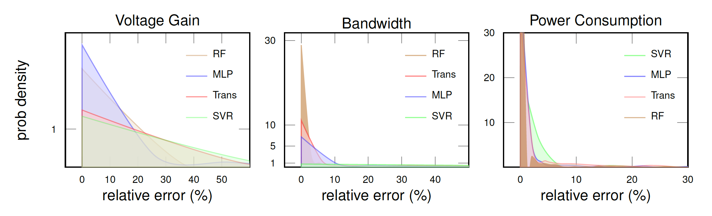
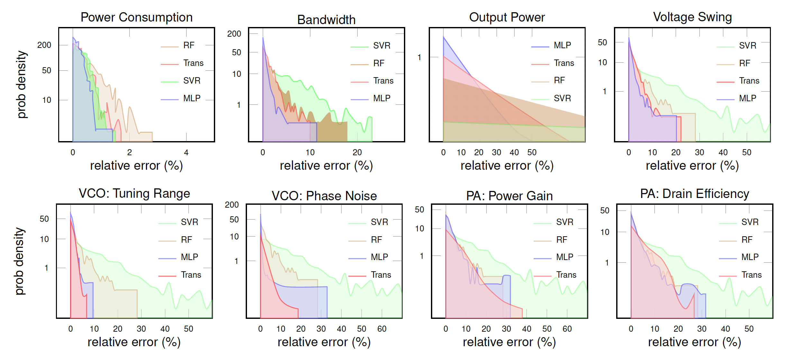

# 🚀 AICircuit: A Multi-Level Dataset and Benchmark for AI-Driven Analog Integrated Circuit Design 

[](https://opensource.org/license/MIT)

**AICircuit** is a comprehensive multi-level dataset and benchmark for developing and evaluating ML algorithms in analog and radio-frequency circuit design. AICircuit comprises seven commonly used basic circuits and two complex wireless transceiver systems composed of multiple circuit blocks, encompassing a wide array of design scenarios encountered in real-world applications. We extensively evaluate various ML algorithms on the dataset, revealing the potential of ML algorithms in learning the mapping from the design specifications to the desired circuit parameters. 

📣 **Updates:** We've added a detailed guide on running simulations and using the Docker container! Check it out here: [SIM_GUIDE.md](./Simulation/SIM_GUIDE.md).
📣 Check out our new paper [**Supervised Learning for Analog and RF Circuit Design: Benchmarks and Comparative Insights**](https://arxiv.org/abs/2501.11839).

## 📖 Table of Contents

  * [Requirements](#-requirements)
  * [Usage](#-usage)
    * [Simple Model Run](#simple-model-run)
    * [Run Simulation](#run-simulation)
    * [Description](#description)
    * [Results](#results)
  * [Visualization](#-visualization)
  * [Paper](#-paper)
  * [Citation](#-citation)
  * [Where to Ask for Help](#-where-to-ask-for-help)

## 🔧 Requirements

To install the requirements you can use:

```
pip install -r requirements.txt
```

## 💡 Usage

### Run Model
To run the code, first change the path for your input data and output results in **arguments** of config files in `Config/Circuits` based on your needs. <br>

Second, generate your own **train config** file, or use our default one. For using the default config file:

```
python3 main.py
```

As an example, if you want to address your own config path and a special seed:

```
python3 main.py --path ./Config/train_config.yaml --seed 0
```

### Run Simulation

To run the simulation, check [SIM_GUIDE.md](./Simulation/SIM_GUIDE.md) for detailed instructions and setup. Then, use the following code:

```
python simulation.py --circuit=CSVA --model=MultiLayerPerceptron --npoints=100
```

### Description
Here is a description for each parameter in the `train_config.yaml` file:

  * `model_config`: a list of different model configs:
    * `model`: 
      * KNeighbors
      * RandomForest
      * SupportVector
      * MultiLayerPerceptron
      * Transformer
    * other model args: add desired model arguments to the `model_config` (no ordering). if no model args added, uses the default ones. For now, you can add:
      * KNeighbors parameters: `n_neighbors`, `weights`
      * RandomForest parameters: `n_estimators`, `criterion`
      * Transformer parameters: `dim_model`, `num_heads`, `num_encoder_layers`, `dim_hidden`, `dropout_p`. 
  * `subset`: a list of the fraction of data used for training.
  * `circuits`: a list of circuits from this list:
    * CSVA: Common-Source Voltage Amplifier
    * CVA: Cascode Voltage Amplifier
    * TSVA: Two-Stage Voltage Amplifier
    * LNA: Low-Noise Amplifier
    * Mixer
    * VCO: Voltage-Controlled Oscillator
    * PA: Power Amplifier
    * Transmitter
    * Receiver
  * `epochs`: used for MLP and Transformer model, default is 100.
  * `loss_per_epoch`: for KNN, RF, or SVR is False, else can be True or False by config value. default is True for MLP and Transformer.
  * `compare_method`: if True, for each subset and circuit, plots different models' loss (MLP and Transformer) on the same figure. 
  * `kfold`: if True, K fold cross validation is performed. K is defined based on `subset` value. if False, no K fold cross validation.
  * `independent_kfold`: if True, train and test data is selected independently from previous folds, if false, dataset is divided to k parts at first and each time one part is selected for test and the remaining for train.
  * `save_format`: 
    * csv
    * numpy
    * anything else: no saving

### Results
 
In each run, find plots in the corresponding folder in `out_plot` folder and loss values in the corresponding folder in `out_result` folder. Also if you set the `train_config.yaml` in a way that it saves the predictions, you can find the prediction files in the mentioned directory at the circuit's yaml file.

## 📈 Visualization
 
Some of our visual results are as follows. For **Two-Stage Voltage Amplifier(TSVA)**, we have:



For **Transmitter**:



## 📚 Paper
  
  "AICircuit: A Multi-Level Dataset and Benchmark for AI-Driven Analog Integrated Circuit Design", by A. Mehradfar, X. Zhao, Y. Niu, S. Babakniya, M. Alesheikh, H. Aghasi, and S. Avestimehr, arxiv: 2407.18272, 2024. 
  * [Paper](https://arxiv.org/abs/2407.18272)
  * In [Machine Learning and the Physical Sciences at NeurIPS 2024](https://ml4physicalsciences.github.io/2024/)

 "Supervised Learning for Analog and RF Circuit Design: Benchmarks and Comparative Insights", by A. Mehradfar, X. Zhao, Y. Niu, S. Babakniya, M. Alesheikh, H. Aghasi, and S. Avestimehr, arxiv: 2501.11839, 2025. 
 * [Paper](https://arxiv.org/abs/2501.11839)

## 🎯 Citation 

If you use AICircuit in a research paper, please cite our works as follows:

```bibtex
@article{Mehradfar2024AICircuit,
      title={AICircuit: A Multi-Level Dataset and Benchmark for AI-Driven Analog Integrated Circuit Design}, 
      author={Asal Mehradfar and Xuzhe Zhao and Yue Niu and Sara Babakniya and Mahdi Alesheikh and Hamidreza Aghasi and Salman Avestimehr},
      journal={Machine Learning and the Physical Sciences Workshop @ NeurIPS},
      year={2024}
}
```

```bibtex
@article{Mehradfar2025Supervised,
  title={Supervised Learning for Analog and RF Circuit Design: Benchmarks and Comparative Insights},
  author={Mehradfar, Asal and Zhao, Xuzhe and Niu, Yue and Babakniya, Sara and Alesheikh, Mahdi and Aghasi, Hamidreza and Avestimehr, Salman},
  journal={arXiv preprint arXiv:2501.11839},
  year={2025}
}
```

## ❓ Where to Ask for Help

If you have any questions, feel free to open a [Discussion](https://github.com/AvestimehrResearchGroup/AICircuit/discussions) and ask your question. You can also email mehradfa@usc.edu (Asal Mehradfar).
